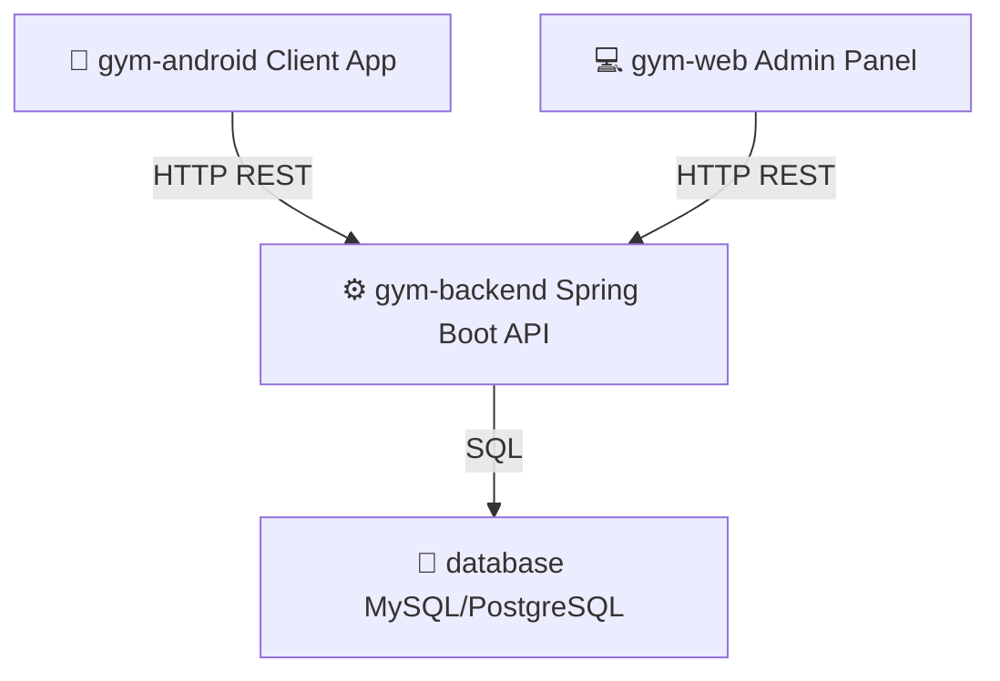

# 🏋️‍♂️ GymManager — Trabajo de Fin de Grado (TFG)

<div align="center">
  <p align="center">
    <strong>Sistema integral multiplataforma para la gestión y administración eficiente de centros deportivos y gimnasios.</strong>
  </p>
  <p align="center">
    Proyecto final de carrera desarrollado para el ciclo formativo de grado superior en <strong>Desarrollo de Aplicaciones Multiplataforma (DAM)</strong>.
  </p>
</div>

---

## 🚀 Descripción del Proyecto

**GymManager** es una solución tecnológica completa diseñada para digitalizar la operativa diaria de un gimnasio. El ecosistema abarca desde la API del backend que gestiona la lógica de negocio y la persistencia de datos, hasta las aplicaciones móviles para los clientes y una plataforma web dedicada para la administración por parte del personal de gestión.

El proyecto está compuesto por cuatro pilares fundamentales:



1. **`gym-backend`:** API REST robusta que centraliza la seguridad, lógica de negocio y persistencia.
2. **`gym-android`:** Aplicación nativa Android orientada al cliente (socios del gimnasio) para reservas, seguimiento de rutinas y perfil.
3. **`gym-web`:** Panel de administración web para directores, entrenadores y personal de recepción.
4. **`database`:** Diseño del modelo relacional y scripts de inicialización.

---

## 🛠️ Tecnologías Utilizadas

Al ser un sistema multiplataforma, implementa un abanico diverso y moderno de tecnologías de desarrollo:

### ⚙️ Backend & Base de Datos
* **Java 17 & Spring Boot:** Framework principal para la creación de la API REST, inyección de dependencias y seguridad.
* **Spring Security & JWT:** Autenticación y autorización basada en tokens para proteger los endpoints.
* **Hibernate / JPA:** ORM para la abstracción y gestión de la base de datos relacional.
* **MySQL / PostgreSQL:** Motor de base de datos relacional para garantizar la integridad de los datos.

### 📱 Cliente Móvil (Android)
* **Kotlin & Java:** Lenguajes principales de desarrollo nativo para Android.
* **Retrofit:** Cliente HTTP seguro para consumir la API de `gym-backend`.
* **Jetpack Components:** Arquitectura moderna (ViewModel, LiveData, Navigation) para una interfaz limpia y desacoplada.

### 💻 Cliente Web (Administración)
* **HTML5, CSS3 & JavaScript (Node.js):** Tecnologías núcleo para una interfaz administrativa fluida y de rápida respuesta.

---

## 📂 Estructura de Directorios

El repositorio está organizado en submódulos claros para aislar las responsabilidades de cada componente:

* 📁 **[gym-android](file:///c:/Users/santi/Downloads/Asha-Kiran-Herramienta-Espa-ol-main/gym-android):** Código fuente de la aplicación móvil nativa (Java/Kotlin).
* 📁 **[gym-backend](file:///c:/Users/santi/Downloads/Asha-Kiran-Herramienta-Espa-ol-main/gym-backend):** Servidor API REST desarrollado con Spring Boot.
* 📁 **[gym-web](file:///c:/Users/santi/Downloads/Asha-Kiran-Herramienta-Espa-ol-main/gym-web):** Código del cliente web de administración para gestores.
* 📁 **[database](file:///c:/Users/santi/Downloads/Asha-Kiran-Herramienta-Espa-ol-main/database):** Scripts de migración, modelado relacional y scripts SQL.
* 📄 **[Memoria_Final_GymManager.pdf](file:///c:/Users/santi/Downloads/Asha-Kiran-Herramienta-Espa-ol-main/Memoria_Final_GymManager.pdf):** Documento académico y memoria descriptiva del TFG que detalla análisis, diseño, desarrollo y pruebas.

---

## 📋 Requisitos de Ejecución

Para desplegar el ecosistema completo localmente, asegúrate de contar con:

* **Java Development Kit (JDK) 17 o superior** (para el backend).
* **Android Studio** actualizado (para compilar la app móvil).
* **Node.js** instalado (para ejecutar el servidor web de administración).
* **Gestor de base de datos** (MySQL o PostgreSQL activo en puerto local).

---

## 📦 Instalación y Configuración

### 1. Base de Datos
1. Crea una base de datos vacía llamada `gymmanager`.
2. Importa el esquema inicial ubicado en la carpeta `/database`.

### 2. Backend (Spring Boot)
1. Importa el proyecto `gym-backend` en tu IDE preferido (IntelliJ IDEA o Eclipse).
2. Configura las credenciales de tu base de datos en el archivo `src/main/resources/application.properties`.
3. Compila y arranca el servidor local:
   ```bash
   ./mvnw spring-boot:run
   ```

### 3. Panel de Administración Web
1. Entra al directorio del panel:
   ```bash
   cd gym-web
   ```
2. Instala dependencias e inicia el servidor web local:
   ```bash
   npm install
   ```
   ```bash
   npm start
   ```

### 4. Aplicación Android
1. Abre el directorio `gym-android` en **Android Studio**.
2. Sincroniza Gradle y configura la dirección IP de tu servidor backend en los archivos de configuración (`network_security_config.xml` o archivo de constantes).
3. Compila y ejecuta la aplicación en un emulador o dispositivo real.

---

## 👤 Autor

* **Santiago Arenas Mira** — *Desarrollador Multiplataforma (DAM)*
  * GitHub: [@zintrx](https://github.com/zintrx)

